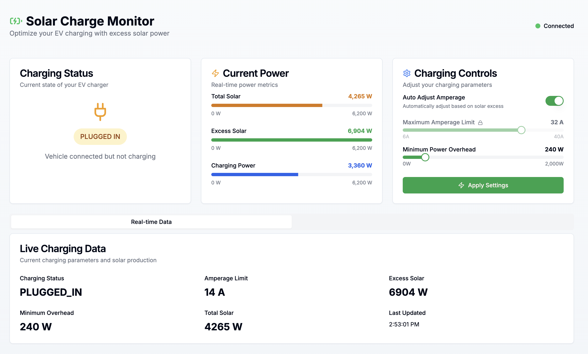

# ChargePoint pyPowerwall Monitor

Use pyPowerwall (https://github.com/jasonacox/pypowerwall)[pyPowerwall Proxy] and (https://github.com/mbillow/python-chargepoint)[python-chargepoint] alongside a ChargePoint Home Flex to charge your EV only off of excess solar power.



## Running with Docker

Assuming you have (https://github.com/jasonacox/pypowerwall/tree/main/proxy)[pyPowerwall Proxy Server] running on localhost:8675:

```sh
docker run --rm -p 8085:8085 \
  -e CHARGEPOINT_USERNAME=YOUR_USERNAME \
  -e CHARGEPOINT_PASSWORD=YOUR_PASSWORD \
  -e PYPOWERWALL_URL=http://localhost:8675 \
  mccahan/chargepoint-monitor:latest
```

Then open your browser to http://localhost:8085/